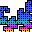

# fractal_sugar

### About the project
**fractal_sugar** is an experimental audio visualizer combining fractals and particle simulations. **Currently, it is Windows-only.** It is written in **Rust** and uses the library [Vulkano](https://github.com/vulkano-rs/vulkano) to interact with the Vulkan API.
3D fractals are rendered using the technique of [ray-marching](http://blog.hvidtfeldts.net/index.php/2011/06/distance-estimated-3d-fractals-part-i/).
Particle physics are simulated using compute shaders.
The open source library [CPAL](https://github.com/rustaudio/cpal) is used to retrieve the audio stream and a fast Fourier transform is applied on the signal using [RustFFT](https://github.com/ejmahler/RustFFT).

### Lineage of previous projects
This project is a merger and re-implementation of several of my previous OpenGL/Vulkan audio visualizers written in **F#**:
* [ColouredSugar](https://github.com/ryco117/ColouredSugar)
* [FractalDimension](https://github.com/ryco117/FractalDimension)
* [FractalDimension-Vulkan](https://github.com/ryco117/FractalDimension-Vulkan)

### Demo
##### deadmau5 Demo

